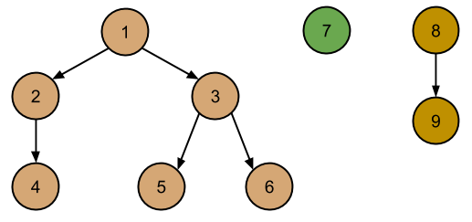

pyScheduler
===========

pyScheduler is very simple pure Python implementation of a task scheduler.

## What is a scheduler?
A task scheduler is a controller that executes tasks in a given order. In this case tasks are executed so that all
tasks are executed before any of its dependencies.

## Why using a scheduler?
Ok, at this point you might be thinking what's the point on building such a contraption if you only want to execute
some tasks. Just put them on list, sort them so that no task is executed before its dependencies, and go ahead! Well,
this is indeed the idea behind a serial scheduler. It does not look very useful indeed...
However things get more exciting once you realize that you can get some profit from the inherent parallelism of your dependency
description. This means that you are not limited to execute one task at a time, but that you can execute all tasks without
dependencies at the same time.

## Going parallel
pyScheduler module offers 3 different scheduler types:
- SerialScheduler - Which is (obviously) not parallel.
- ProcessParallelScheduler - Which uses multiprocessing module to run tasks in parallel.
- MPIParallelScheduler - Which uses the great [mpi4py](http://mpi4py.scipy.org/) module to run the tasks in parallel.

Use ProcessParallelScheduler if you plan to use the parallelism of your local machine. MPIParallelScheduler is better
if you want to use your scheduler in a cluster. When using an MPI scheduler, remember that you must run your Python
script using *mpirun* (-np number_of_processes) or it will not work (Process-based scheduler allows the specification
of the number of processes in the constructor).

## Very simple example (from the test package)
Imagine we want to execute 10 tasks which dependencies between themselves are like this:
</img>

First step would be to create an scheduler and define the tasks:
```
scheduler = SerialScheduler()
scheduler.add_task(task_name = "1", dependencies = ["2","3"], description ="",target_function = test_function ,function_kwargs={"this":1})
scheduler.add_task(task_name = "2", dependencies = ["4"], description ="",target_function = test_function ,function_kwargs={"this":2})
scheduler.add_task(task_name = "3", dependencies = ["5","6"], description ="",target_function = test_function ,function_kwargs={"this":3})
scheduler.add_task(task_name = "4", dependencies = [], description ="",target_function = test_function ,function_kwargs={"this":4})
scheduler.add_task(task_name = "5", dependencies = [], description ="",target_function = test_function ,function_kwargs={"this":5})
scheduler.add_task(task_name = "6", dependencies = [], description ="",target_function = test_function ,function_kwargs={"this":6})
scheduler.add_task(task_name = "7", dependencies = [], description ="",target_function = test_function ,function_kwargs={"this":7})
scheduler.add_task(task_name = "8", dependencies = ["9"], description ="",target_function = test_function ,function_kwargs={"this":8})
scheduler.add_task(task_name = "9", dependencies = [], description ="",target_function = test_function ,function_kwargs={"this":9})
```
The code above shows how to create a SerialScheduler (the other two are created more or less in the same way) and adding the
tasks. Each task is defined by its identifier (which has to be unique), a description (that can be empty) and a callable and
the arguments we want to pass to this callable when is executed. Finally, the method also accepts a dependencies array. This array
contains the ids of the taks the task we are defining depends on.

The last step would be just to run the scheduler:
```
scheduler.run()
```
Taks will run in this order (7,9 and 8 could be run before the others though):
    4 -> 2 -> 5 -> 6 -> 3 -> 1 -> 7 -> 9 -> 8

If you want to parallelize the execution of your tasks, just change the first line by something like:
```
parallel = ProcessParallelScheduler(4)
```
And your computer will use 4 processes to complete the job (as one is used as a control node, only 3 processes will 
contribute to the work).  

## Where is the documentation?
Modules are profusely documented. Give the code a chance!

## Next moves
Things yet to do include a mechanism to allow tasks to work with the results of their direct or indirect dependencies
and some sort of checker to warn about (and avoid) the definition of dependency cycles.